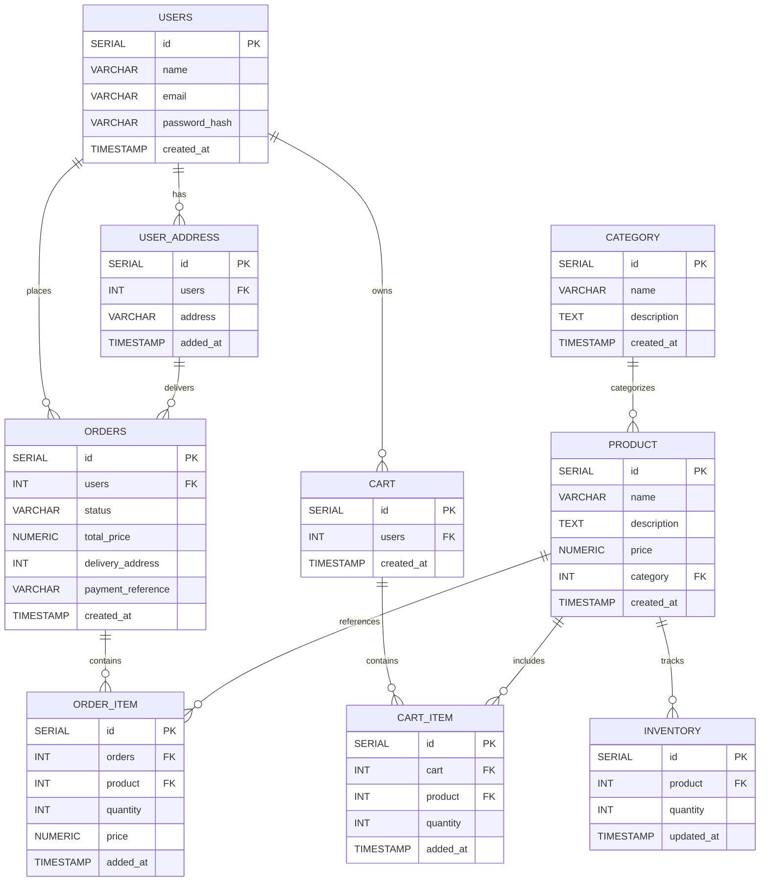

The entity relationship erDiagram :

```mermaid
    erDiagram
        USERS ||--o{ USER_ADDRESS : "has"
        USERS ||--o{ CART : "owns"
        USERS ||--o{ ORDERS : "places"
        CATEGORY ||--o{ PRODUCT : "categorizes"
        PRODUCT ||--o{ INVENTORY : "tracks"
        CART ||--o{ CART_ITEM : "contains"
        PRODUCT ||--o{ CART_ITEM : "includes"
        ORDERS ||--o{ ORDER_ITEM : "contains"
        PRODUCT ||--o{ ORDER_ITEM : "references"
        USER_ADDRESS ||--o{ ORDERS : "delivers"
    
        USERS {
            SERIAL id PK
            VARCHAR name
            VARCHAR email
            VARCHAR password_hash
            TIMESTAMP created_at
        }
    
        USER_ADDRESS {
            SERIAL id PK
            INT users FK
            VARCHAR address
            TIMESTAMP added_at
        }
    
        CATEGORY {
            SERIAL id PK
            VARCHAR name
            TEXT description
            TIMESTAMP created_at
        }
    
        PRODUCT {
            SERIAL id PK
            VARCHAR name
            TEXT description
            NUMERIC price
            INT category FK
            TIMESTAMP created_at
        }
    
        INVENTORY {
            SERIAL id PK
            INT product FK
            INT quantity
            TIMESTAMP updated_at
        }
    
        CART {
            SERIAL id PK
            INT users FK
            TIMESTAMP created_at
        }
    
        CART_ITEM {
            SERIAL id PK
            INT cart FK
            INT product FK
            INT quantity
            TIMESTAMP added_at
        }
    
        ORDERS {
            SERIAL id PK
            INT users FK
            VARCHAR status
            NUMERIC total_price
            INT delivery_address
            VARCHAR payment_reference
            TIMESTAMP created_at
        }
    
        ORDER_ITEM {
            SERIAL id PK
            INT orders FK
            INT product FK
            INT quantity
            NUMERIC price
            TIMESTAMP added_at
        }
```