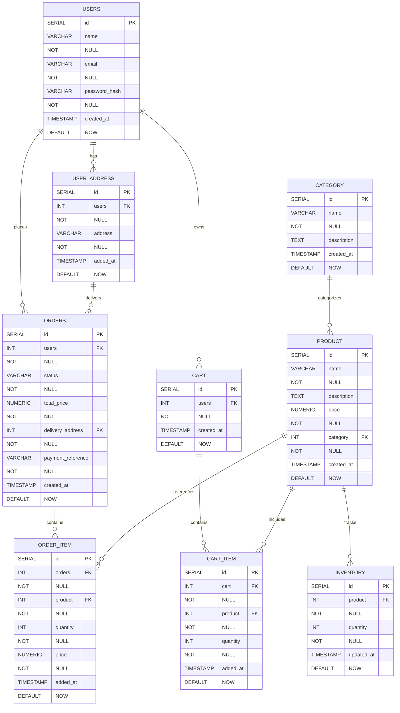

The entity relationship erDiagram :

```mermaid
    erDiagram
        USERS ||--o{ USER_ADDRESS : "has"
        USERS ||--o{ CART : "owns"
        USERS ||--o{ ORDERS : "places"
        CATEGORY ||--o{ PRODUCT : "categorizes"
        PRODUCT ||--o{ INVENTORY : "tracks"
        CART ||--o{ CART_ITEM : "contains"
        PRODUCT ||--o{ CART_ITEM : "includes"
        ORDERS ||--o{ ORDER_ITEM : "contains"
        PRODUCT ||--o{ ORDER_ITEM : "references"
        USER_ADDRESS ||--o{ ORDERS : "delivers"
        
        USERS {
            SERIAL id PK
            VARCHAR name NOT NULL
            VARCHAR email NOT NULL
            VARCHAR password_hash NOT NULL
            TIMESTAMP created_at DEFAULT NOW
        }
    
       USER_ADDRESS {
            SERIAL id PK
            INT users FK NOT NULL
            VARCHAR address NOT NULL
            TIMESTAMP added_at DEFAULT NOW
       }
    
       CATEGORY {
            SERIAL id PK
            VARCHAR name NOT NULL
            TEXT description
            TIMESTAMP created_at DEFAULT NOW
       }
        
       PRODUCT {
            SERIAL id PK
            VARCHAR name NOT NULL
            TEXT description
            NUMERIC price NOT NULL
            INT category FK NOT NULL
            TIMESTAMP created_at DEFAULT NOW
       }
    
       INVENTORY {
            SERIAL id PK
            INT product FK NOT NULL
            INT quantity NOT NULL
            TIMESTAMP updated_at DEFAULT NOW
       }
    
       CART {
            SERIAL id PK
            INT users FK NOT NULL
            TIMESTAMP created_at DEFAULT NOW
       }
    
       CART_ITEM {
            SERIAL id PK
            INT cart FK NOT NULL
            INT product FK NOT NULL
            INT quantity NOT NULL
            TIMESTAMP added_at DEFAULT NOW
       }
    
       ORDERS {
            SERIAL id PK
            INT users FK NOT NULL
            VARCHAR status NOT NULL
            NUMERIC total_price NOT NULL
            INT delivery_address FK NOT NULL
            VARCHAR payment_reference NOT NULL
            TIMESTAMP created_at DEFAULT NOW
       }
    
       ORDER_ITEM {
            SERIAL id PK
            INT orders FK NOT NULL
            INT product FK NOT NULL
            INT quantity NOT NULL
            NUMERIC price NOT NULL
            TIMESTAMP added_at DEFAULT NOW
       }
```